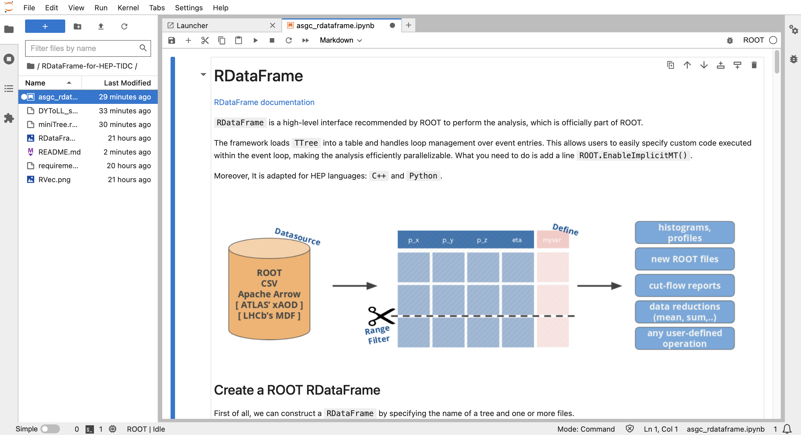

# RDataFrame-for-HEP-TIDC
The tutorial of analysis framework for HEP &amp; TIDC using RDataFrame
https://indico4.twgrid.org/event/35/

# Setup the environment
```bash
conda create --name <env_name_you_want> --file requirements.txt
conda activate <env_name_you_want>
python -m ipykernel install --user --name=kernal_name_you_want
```

# Lanch the Jupyter lab in DiCOS
Go to https://dicos.grid.sinica.edu.tw/dockerapps/.

